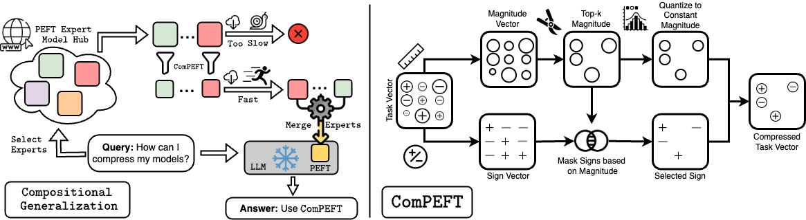

# [ComPEFT: Compression for Communicating Parameter Efficient Updates via Sparsification and Quantization](https://arxiv.org/abs/2311.13171)

* Authors: [Prateek Yadav](https://prateeky2806.github.io/), [Leshem Choshen](https://ktilana.wixsite.com/leshem-choshen), [Colin Raffel](https://colinraffel.com/), and [Mohit Bansal](https://www.cs.unc.edu/~mbansal/)
* Paper: [arXiv](https://arxiv.org/abs/2311.13171)




## Setup

1. Create a virtual environment and activate it.
```
conda create -n compeft python==3.9
conda activate compeft
pip install -r requirements.txt
cd src
```

2. Set the path to where finetuned models are stored in src/utils.py

## Train

### Finetune BERT like Models.
To train checkpoint for BERT like models you can use the file `src/bert_finetune.py`. A sample command for training MRPC from GLUE is given below.

Full Model finetuning
```
python bert_finetune.py --learning_rate=5e-05 --train --test --model_name_or_path=bert-large-uncased --num_epochs=10 --project_name=ft_bertlarge --task=mrpc
```

(IA)^3 Finetuning
```
python bert_finetune.py --learning_rate=0.005 --peft=ia3 --train --test --model_name_or_path=bert-large-uncased --num_epochs=10 --project_name=ft_bertlarge --task=mrpc
```

LoRA Finetuning
```
python bert_finetune.py --learning_rate=0.0005 --peft=lora --train --test --model_name_or_path=bert-large-uncased --num_epochs=10 --project_name=ft_bertlarge --task=mrpc
```

### Finetune T5 like models.
To train checkpoint for T5 like models (T5, T5v1.1, T0) you can use the file `src/t5_finetune.py`. A sample command for training RTE from GLUE is given below.

Full Model finetuning
```
python t5_finetune.py --project_name=ft_t5base --model_name_or_path=t5-base --train=True --task=rte --num_epochs=2 --learning_rate=3e-4
```

(IA)^3 Finetuning
```
python t5_finetune.py --project_name=ft_t5base --model_name_or_path=t5-base --train=True --task=rte --num_epochs=2 --learning_rate=3e-4 --peft=ia3
```

LoRA Finetuning
```
python t5_finetune.py --project_name=ft_t5base --model_name_or_path=t5-base --train=True --task=rte --num_epochs=2 --learning_rate=3e-4 --peft=lora
```


## Compress using Compeft and evaluate.
$K = # set density between 0-100

$replace_factor = # set the values of alpha.


### BERT-like models
Compress Fully Finetuned BERT Model.
```
python bert_eval.py --model_name_or_path t5-base --task rte  --k ${K} --replace_factor ${replace_factor} --project_name eval_t5base
```

Compress (IA)^3 on BERT Model.
```
python bert_eval.py --model_name_or_path t5-base --task rte --peft ia3 --k ${K} --replace_factor ${replace_factor} --project_name eval_t5base
```

Compress LoRA on BERT Model.
```
python bert_eval.py --model_name_or_path t5-base --task rte --peft lora  --k ${K} --replace_factor ${replace_factor} --project_name eval_t5base
```


### T5-like models
Compress Fully Finetuned T5 Model.
```
python t5_eval.py --model_name_or_path t5-base --task rte --k ${K} --replace_factor ${replace_factor} --project_name eval_t5base
```

Compress (IA)^3 on T5 Model.
```
python t5_eval.py --model_name_or_path t5-base --task rte --peft ia3 --k ${K} --replace_factor ${replace_factor} --project_name eval_t5base
```

Compress LoRA on T5 Model.
```
python t5_eval.py --model_name_or_path t5-base --task rte --peft lora  --k ${K} --replace_factor ${replace_factor} --project_name eval_t5base
```

### Compress QLoRA on LLaMA
$model_name_or_path = # LLaMA checkpoint dir.

$checkpoint_dir = #lora checkpoint dir

$output_dir = # output dir to store results.

```
python qlora_eval.py --project_name eval_llama  --model_name_or_path ${model_name_or_path} --checkpoint_dir ${checkpoint_dir} --k ${K} --replace_factor ${replace_factor} --output_dir ${output_dir} --mmlu_split eval --report_to wandb --data_seed 42 --per_device_eval_batch_size 1 --max_new_tokens 32 --dataloader_num_workers 4 --logging_strategy steps --remove_unused_columns False --group_by_length True --do_eval True --double_quant True --bf16 True --quant_type nf4 --bits 4 --dataset oasst1 --source_max_len 512 --target_max_len 512 --seed 0
```


# Reference
Please consider citing our paper if you use our code or models in your work:


```bibtex
@misc{yadav2023compeft,
      title={ComPEFT: Compression for Communicating Parameter Efficient Updates via Sparsification and Quantization}, 
      author={Prateek Yadav and Leshem Choshen and Colin Raffel and Mohit Bansal},
      year={2023},
      eprint={2311.13171},
      archivePrefix={arXiv},
      primaryClass={cs.LG}
}
